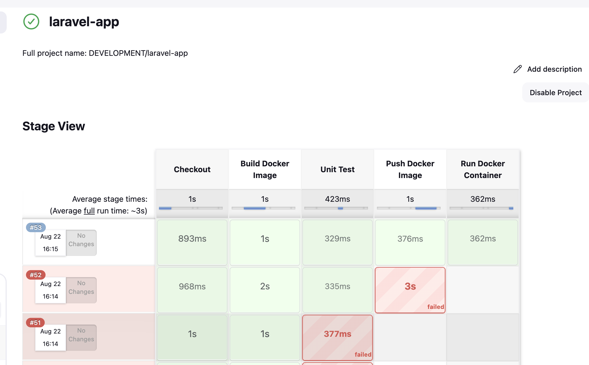

# Laravel Hello-World with Docker and Jenkins CI/CD

This project is a simple Laravel application that is dockerized and integrated with Jenkins for automated **CI/CD**.

## Directory Structure

```
Dockerize/
└── Laravel/
    ├── hello-world/        # Laravel application
    │   └── Dockerfile      # Dockerfile for the Laravel application
└── Jenkins/               # Jenkins CI/CD pipeline and CASC configuration
```

## Features

- Checkout source code from Git
- Build Docker image for the Laravel application
- Run Unit Tests
- Push Docker image to a registry if Unit Tests pass
- Deploy & run Docker container on the server
- Pipeline stops if Unit Tests fail (no push or deploy)
- Jenkins fully configured via **Configuration as Code (JCasC)**

## Jenkins CI/CD Flow

The Jenkins pipeline has the following stages:

1. **Checkout** – Pull the source code from Git repository.
2. **Build Docker Image** – Build Docker image from `Dockerfile` in `Dockerize/Laravel/hello-world`.
3. **Unit Test** – Run PHPUnit and `php artisan test` inside the Docker container. Stops if tests fail.
4. **Push Docker Image** – Push Docker image to Docker Hub only if tests pass.
5. **Run Docker Container** – Deploy and run the Docker container on the target server.

## Jenkins Job DSL Pipeline

```groovy
import groovy.json.JsonSlurper

def project_env = "DEVELOPMENT"
def service = "laravel-app"

pipelineJob("${project_env}/${service}") {

    logRotator { numToKeep(10) }

    definition {
        cps {
            sandbox()
            script('''

                node {
                    try {
                        stage('Checkout') {
                            checkout([$class: 'GitSCM',
                                branches: [[name: "main"]],
                                doGenerateSubmoduleConfigurations: false,
                                extensions: [],
                                userRemoteConfigs: [[
                                    url: 'https://github.com/kayyazka/idsys'
                                ]]
                            ])
                        }

                        stage('Build Docker Image') {
                            sh """                      
                            docker build -t kayyazka/laravel:latest -f \$WORKSPACE/Dockerize/Laravel/hello-world/Dockerfile  \$WORKSPACE/Dockerize/Laravel/hello-world/
                            """
                        }
                        
                        stage('Unit Test') {
                            sh """
                            docker run --rm kayyazka/laravel:latest ./vendor/bin/phpunit
                            docker run --rm kayyazka/laravel:latest php artisan test
                            """
                        }

                        stage('Push Docker Image') {
                            sh "docker push kayyazka/laravel:latest"
                        }

                        stage('Run Docker Container') {
                            sh """
                            docker run -d --name laravel-app-test -p 8000:80 kayyazka/laravel:latest
                            """
                        }

                    } catch (e) {
                        currentBuild.result = "FAILED"
                        throw e
                    }
                }

'''.stripIndent())
        }
    }
}
```

## Jenkins Configuration as Code (JCasC)

You can configure Jenkins completely using a YAML file (`jenkins-casc.yaml`). Example:

```yaml
  jenkins:
    systemMessage: "Welcome to Jenkins configured by CASC"
    securityRealm:
      local:
        allowsSignup: false
        users:
          - id: "admin"
            password: "admin"
    authorizationStrategy: loggedInUsersCanDoAnything
  jobs:
    - script: >
        pipelineJob('JOB-DSL') {
          definition {
            cps {
              script("""

                node {
                    try {
                        stage('Create Folders') {
                            jobDsl scriptText: "folder('DEVELOPMENT')",
                                ignoreExisting: true
                        }

                        stage('Create a Project') {
                            jobDsl targets: 'job-pipelines/*.groovy',
                            removedJobAction: 'DELETE',
                            removedViewAction: 'DELETE',
                            lookupStrategy: 'SEED_JOB',
                            sandbox: false 
                        }

                    } catch (e) {
                        currentBuild.result = "FAILED"
                        throw e
                    }
                }

              """)
              sandbox()
            }
          }
          logRotator {
            numToKeep 10
          }
        }

```

### Notes on JCasC

- Place `jenkins-casc.yaml` in a volume mounted to Jenkins container:
```yaml
volumes:
  - ./jenkins-casc.yaml:/var/jenkins_home/casc_configs/jenkins-casc.yaml
```
- Enable JCasC in Jenkins settings:
  **Manage Jenkins → Configuration as Code → Path to YAML**
- Jenkins will automatically create pipelines, credentials, and plugins as defined in YAML.

## Requirements

To run this pipeline successfully, you need:

- **Jenkins** with the following plugins installed:
  - Docker Pipeline
  - Git
  - Job DSL
  - Configuration as Code (JCasC)
- **Docker** installed on the Jenkins server or agent
- **Docker Hub account** and credentials added in Jenkins (used for pushing Docker images)
- **Laravel project** with unit tests ready to run
- **Dockerfile** correctly configured in `Dockerize/Laravel/hello-world/`
- Access to the server where the Docker container will be deployed

## How to Use

1. Clone the repository:
```bash
git clone https://github.com/kayyazka/idsys.git
cd Dockerize/Laravel
```
2. Start Jenkins using Docker Compose and follow logs:
```bash
docker-compose up -d
docker logs -f jenkins
```
3. Deploy Jenkins with JCasC and Job DSL.
4. Run the pipeline:
   - Pass Unit Tests → Docker image is pushed & container runs
   - Fail Unit Tests → pipeline stops, no push or deploy
  
5. Access Laravel application at `http://<server-ip>:8000`

---

**Note:**
This pipeline ensures **code quality** before pushing the image to the registry and deploying to the server.

